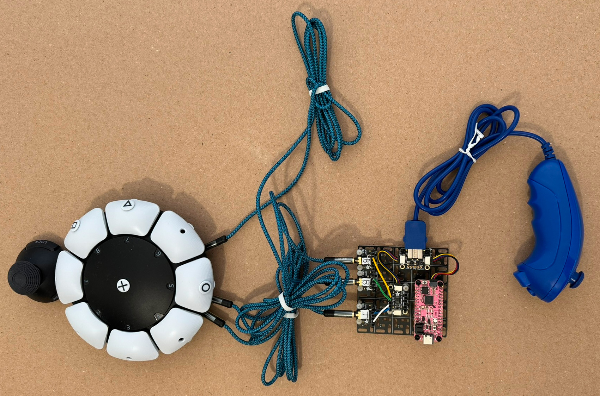
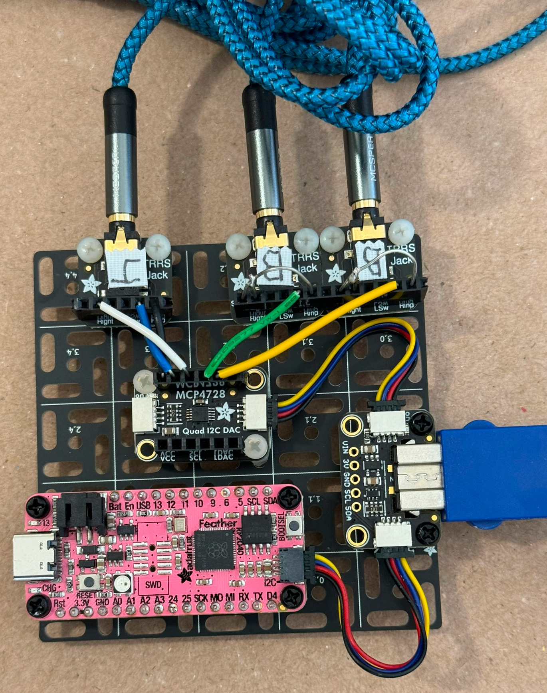
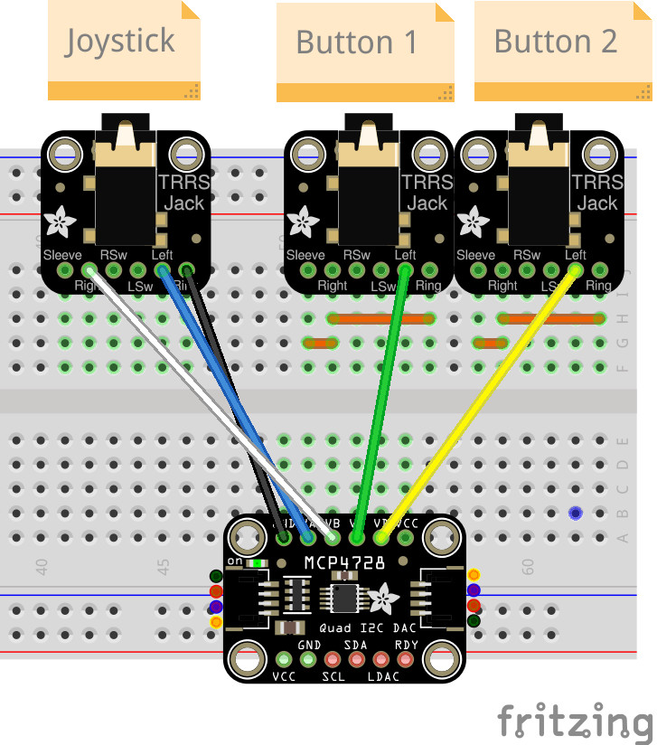
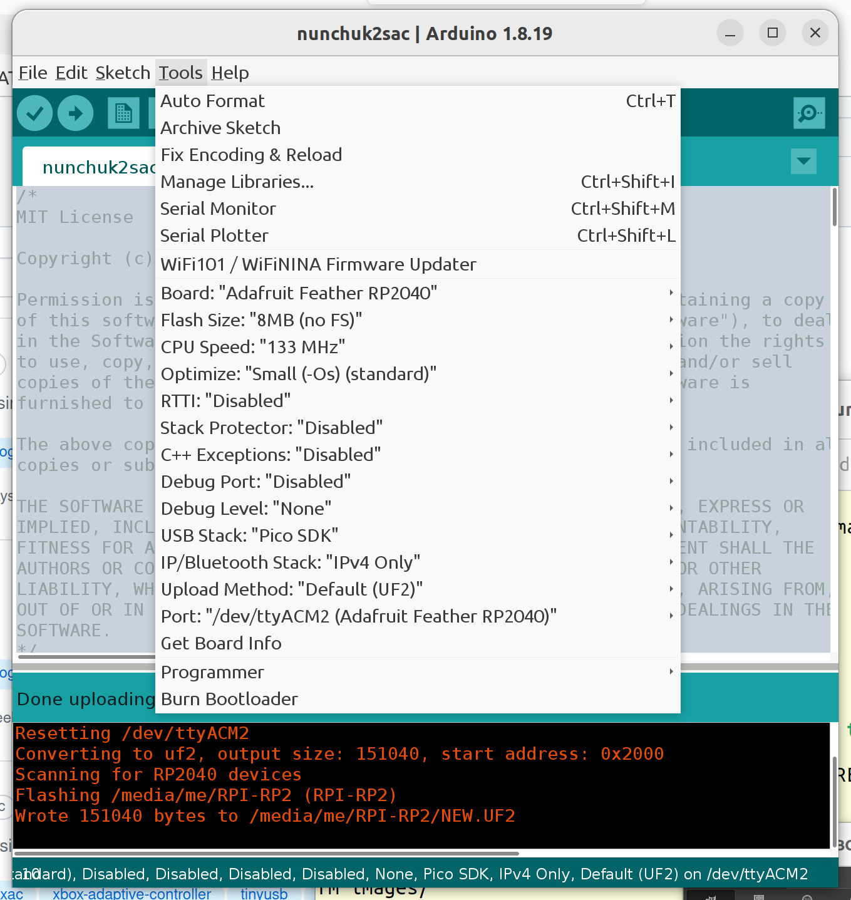

# Connect Wii Nunchuk to Sony Access Controller

The Sony Access Controller (SAC) for PlayStation 5 (PS5) includes 10 buttons, a
joystick, and four expansion ports. The expansion ports are for analog
joysticks, analog triggers, and buttons.

The Wii Nunchuk handheld controller has two buttons and a joystick.

This project reads the nunchuk joystick and button inputs then drives three
SAC expansion ports to relay the button presses and stick movement. A four
channel DAC has just enough outputs for this.

## Hardware

* 1 X Adafruit Feather RP2040
* 2 X STEMMA QT/QWIIC JST SH 4-pin cable
* 1 X Adafruit Wii Nunchuck Breakout Adapter
* 1 X Wii Nunchuk game controller or clone
* 1 X Adafruit MCP4728 Quad DAC with EEPROM
* 3 X Adafruit TRRS Jack Breakout Board
* 3 X TRRS cables
* 1 X Adafruit Swirly Aluminum Mounting Grid for 0.1" Spaced PCBs - 5x5
* 1 X USB cable with Type C connector for the Feather RP2040 and the appropriate connector for your computer.
* 1 X Sony Access Controller (SAC) for PS5
* Various headers and wires
* M2.0 and M2.5 nylon screws and spacers
* Optional battery for Feather board
* 1 X 5V phone charger with USB Type C connector to power/charge the Feather board

This project does not use a breadboard but the following diagram shows the
equivalent connections as shown in the photo. The diagram more clearly shows
the hand wired connections between boards. In the photo the labels printed on
the boards are covered by the headers.

Plug the boards together as shown in the photo and diagram except leave out the
SAC for now. Upload the UF2 file to the Feather board before connecting the
SAC. Connect the SAC then configure the Access Controller expansion ports for
the joystick and two buttons.

The Feather board must be powered to work. If you do not want to connect it to
a computer USB port, connect it to a phone charger with USB Type C connector.
The board can also be powered from an optional battery.

## Building Source Code

If you do not want to use the UF2 file, full source code is provided.
The following tutorial explains how to set up the Arduino IDE.

https://learn.adafruit.com/adafruit-feather-rp2040-pico

The project was tested using Arduino IDE 1.8.19.

The following can be installed using the IDE Library Manager.

* "Nintendo Extension Ctrl" by David Madison
* "Adafruit BusIO" by Adafruit

The following can be downloaded as a ZIP file then installed using the IDE
"Add .ZIP Library" option.

* https://github.com/touchgadget/Adafruit_MCP4728_eeprom

The build options are default values for the Feather board.

## CircuitPython

If you prefer Python, see ./python/sac_nunchuk.py. This was tested using CP
9.0.4.

## Alternatives

### Battery not needed

If the battery option is not needed, the Feather board may be replaced with
a Raspberry Pi Pico board. The Pico does not have a QWIIC connector so some
extra soldering and wiring will be required.

### USB HID Devices

Replacing the Feather board with a "Adafruit Feather RP2040 with USB Type A
Host" board is a separate project. The USB host port allows USB HID devices
to work with the SAC.
